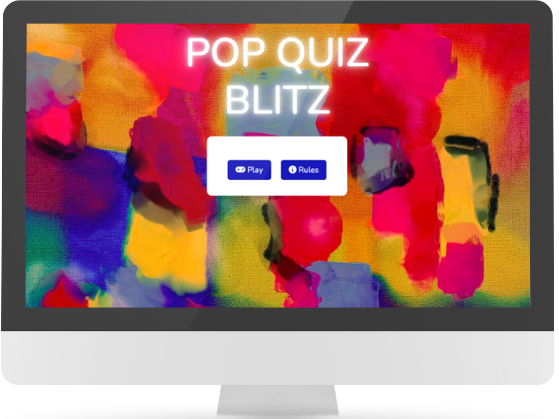
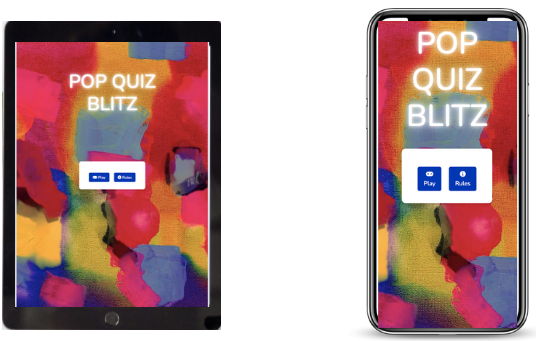
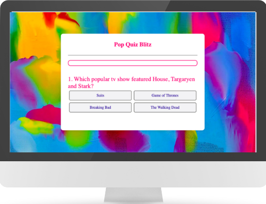
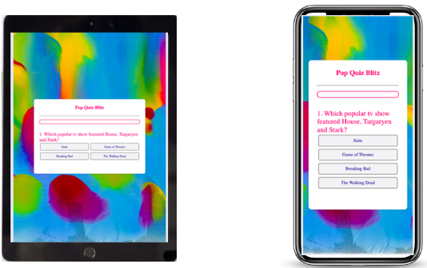
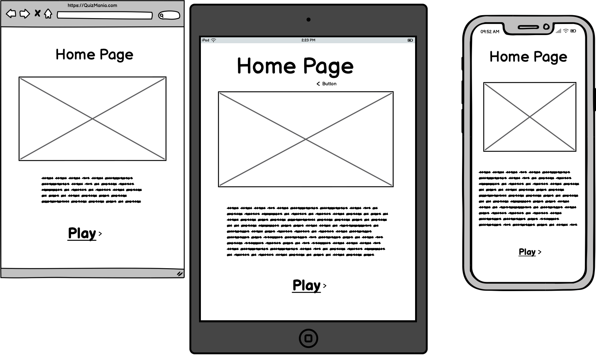
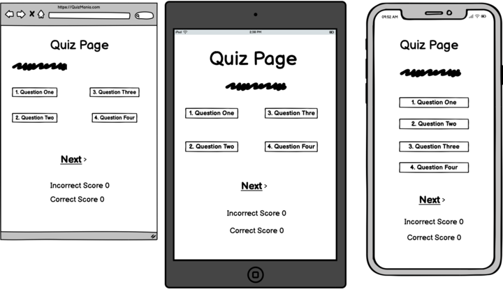

# Pop-Quiz-Blitz

## Brief Introduction

Pop Quiz Blitz is an Pop Culture Quiz made using HTML, CSS and JavaScript. It has been designed and implemented by our team of two for our first Hackathon, for The Code Institute's 16-week AI-Augmented Full Stack Development course.

## Responsivity Example Image

We have created a quiz which has interactive features and its design is responsive. We have created this quiz with the simple fact that it can be viewed from any device and will adjust to any type of device as we have added the various different breakpoints.

### Home Page

### Quiz Page 

## Contents

TO BE INSERTED

## (UX) User Experience

### User Stories

I used co-pilot to create 10 user stories. I asked co-pilot "i am creating a pop culture quiz sit using html, css and javascript. can you create 10 user stories using AS A... I WANT TO... SO I CAN... please?" I then defined each answer to fit my needs and time constraints. 
1.	As a user, I want to see one question at a time with multiple choice answers, so that I can focus on each question and answer accurately. (must-have)
2.	As a user, I want to see an attractive and informative homepage, so that I can understand what the site offers and navigate easily. (must-have)
3.	As a user, I want to have a responsive design, so I can take the quiz on any device. (must-have)
4.	As a user, I want to see my score at the end of the quiz, so I can know how well I did. (must-have)
5.	As a user, I want to have a timer for each question, so I can challenge myself to answer quickly. (should-have)
6.	As a user, I want to see a progress bar, so I can know how many questions are left. (should-have)
7.	As a user, I want to be able to restart the quiz, so I can try again to improve my score. (must-have)
8.	As a user, I want to be able to see the correct answer if i give an incorrect answer, so that I can understand my mistakes. (must-have)
9.	As a user, I want to see a summary of my answers at the end of the quiz, so I can review my choices.(could-have)
10.	As a user, I want to have a leaderboard, so I can compare my score with other users.(could-have)

### Project Board

The user stories were then turned into 'issues' using a project board which allowed us to define the mvp and allocate tasks to prevent merge conflicts. 

(INSERT SCREENSHOT OF PROJECT BOARD)

## Wireframes

Below I have added the wireframes that were created by me and my teammate. We chose to go for a simple but yet effective design as we were creating a quiz we did not want the user to become too distracted if we had added many other features. We have included 2 wireframes one for the homepage and one for the quiz page itself.

### Homepage Wireframe

### Quiz Page Wireframe

## Design

### Colour Scheme

During the planning for the design for our quiz we wanted to choose bold, vibrant colours as we closely associated this with the fun aspect of pop culture. We looked up colour palettes for a pop culture quiz on google, then found the one we like the most: (insert website link and screenshot of colour palette). 

### Imagery

We also wanted a background image for the homepage so we looked on pexels (make the word a link for the website) for a image that best fits our theme and colour scheme. (insert actual image).
We also used a contast colour checked to ensure the colours did not clash with each other.
(inset screenshot)

### Typography

When looking for fonts for our quiz we wanted something looked 'fun' for our standout text such as our heading and questions while also having somethings simple for any other text. 

## Website Features

### Homepage

The homepage shows two buttons; 'Play' that starts the quiz and 'Rules' that makes a modal pop up explaining  the rules for the game.
(insert image of homepage)

### Quiz page

The quiz displays one question after the other, the user must select an answer or it times out before the next button is enabled.
(insert image of quiz page)

## Future Features

*  More questions to make the test last a bit longer.
*  Implementing a leader board to compare scores with other people who have taken the quiz.

## Technogologies Used

### Languages 

HTML5, CSS3, JAVASCRIPT, GITHUB

### Libraries

BOOTSTRAP, FONTAWESOME, GOOGLEFONTS

### Tools and Programs
FAVICON.IO, BALSAMIQ, MSCOPILOT

## Deployment
The process is as follows:
1.	Log in to your GitHub profile
2.	Click create a new repository and create a name for it
3.	Click the code icon and copy the url for the repo
4.	Open Vs code locally and click open folder and choode where you want this to be stored
5.	 Then open a new terminal and type "git clone (url).
6.	Once it has created the folder with the name you chose you can being working in your workspace.

## Testing
We used HTML AND CSS validator, CSS autoprefixer, JS debugger, DevTools and Lighthouse (insert screenshots of each result)

## Credits

(TO BE INSERTED)

